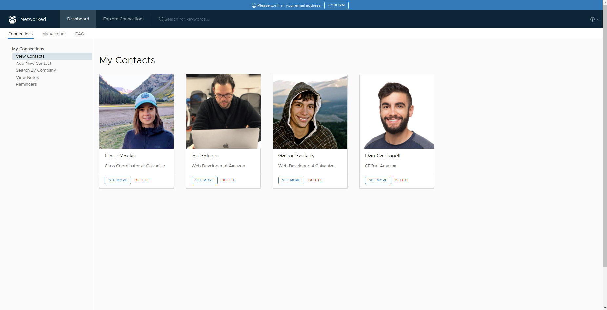
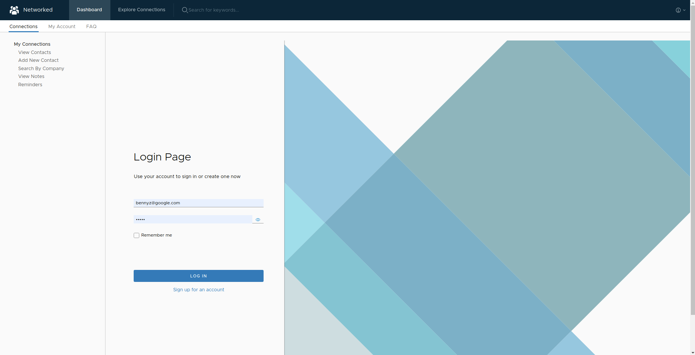

# Networked - Track Your Professional Network

Networked is a full-stack, fully featured Career Networking application developed using Angular 7 and Nest.js. Through the app, career seekers are able to add new connections, create notes and reminders for important events, as well as view their network and professional growth in a visual and easy-to-track manner.




## Table of Contents

- [Networked - Track Your Professional Network](#networked---track-your-professional-network)
  - [Table of Contents](#table-of-contents)
  - [Getting Started](#getting-started)
    - [Prerequisites](#prerequisites)
    - [Installing](#installing)
  - [Running The Tests](#running-the-tests)
    - [End To End Testing](#end-to-end-testing)
  - [Coding Style](#coding-style)
  - [Built With](#built-with)
  - [Versioning](#versioning)
  - [Authors](#authors)
  - [License](#license)

## Getting Started

These instructions will get you a copy of the project up and running on your local machine for development and testing purposes. See deployment for notes on how to deploy the project on a live system.

### Prerequisites

The application utilizes Node.js, which can be downloaded at the following [link](https://nodejs.org/en/download/).

The Angular CLI must also be installed to initialize and run the client-side code. To install, run the following:

```sh
npm install -g @angular/cli
```

### Installing

In order to install the application's dependencies, run the following terminal commands:

In the "client" directory:

```sh
npm install
```

In the "server" directory:

```
npm install
```

In order to compile a production build, run the following in the "client" directory:

```sh
npm run build
```

## Running The Tests

To run unit tests with Karma:

```
npm run test
```

### End To End Testing

End-to-end testing consisted of using Jasmine and Karma to test interactivity between dynamic page elements including modals, button clicks and tabs.

Example:

```
When user clicks the "Login" tab, the ngRouter should switch main view layer to login page.
```

## Coding Style

This application utilizes TSLint for linting to make sure the code conforms to the rigorous industry style standards. The codebase remains up-to-date with the A11y accessibility requirements in order to provide all users with a positive experience on the app.

## Built With

- [Angular 8](https://angularjs.org) - Front-end framework used
- [NgRx](https://ngrx.io/) - Redux-based state management solution
- [RxJS](http://reactivex.io/) - Reactive programming
- [Node.js](https://nodejs.org/en/) - Server-side language
- [Nest.js](https://nestjs.com/) - Server-side framework used
- [MongoDB](https://www.mongodb.com/) - Data persistence
- [Mongoose](https://mongoosejs.com/) - ORM
- [SCSS](https://sass-lang.com/) - CSS preprocessor

## Versioning

This application uses [SemVer](http://semver.org/) for versioning. For the versions available, see the [tags on this repository](https://github.com/your/project/tags).

## Authors

- **Gabor Szekely** - _Project lead_ - [gaborszekely](https://github.com/gaborszekely)

## License

This project is licensed under the MIT License - see the [LICENSE.md](LICENSE.md) file for details
